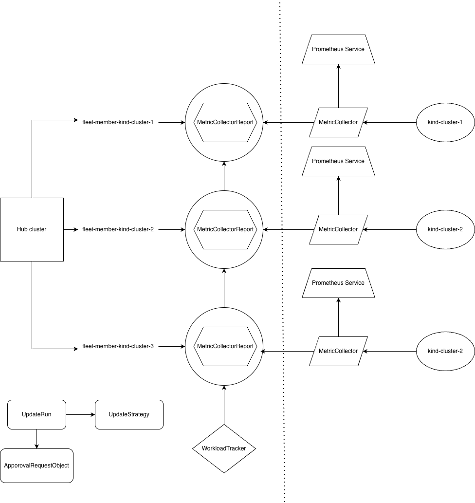

# Approval Controller and Metric Collector Tutorial

This tutorial demonstrates how to use the Approval Request Controller and Metric Collector with KubeFleet for automated staged rollout approvals based on workload health metrics.

## Overview

This directory contains two controllers:
- **approval-request-controller**: Runs on the hub cluster to automate approval decisions for staged updates
- **metric-collector**: Runs on member clusters to collect workload health metrics from Prometheus



## How It Works

### Custom Resource Definitions (CRDs)

This solution introduces three new CRDs that work together with KubeFleet's native resources:

#### Hub Cluster CRDs

1. **MetricCollector** (cluster-scoped)
   - Defines Prometheus connection details and where to report metrics
   - Gets propagated to member clusters via ClusterResourcePlacement (CRP)
   - Each member cluster receives a customized version with its specific `reportNamespace`

2. **MetricCollectorReport** (namespaced)
   - Created by metric-collector on member clusters, reported back to hub
   - Lives in `fleet-member-<cluster-name>` namespaces on the hub
   - Contains collected `workload_health` metrics for all workloads in a cluster
   - Updated every 30 seconds by the metric collector

3. **ClusterStagedWorkloadTracker** (cluster-scoped)
   - Defines which workloads to monitor for a ClusterStagedUpdateRun
   - The name must match the ClusterStagedUpdateRun name
   - Specifies namespace, workload name, and expected health status
   - Used by approval-request-controller to determine if stage is ready for approval

4. **StagedWorkloadTracker** (namespaced)
   - Defines which workloads to monitor for a StagedUpdateRun
   - The name and namespace must match the StagedUpdateRun name and namespace
   - Specifies namespace, workload name, and expected health status
   - Used by approval-request-controller to determine if stage is ready for approval

### Automated Approval Flow

1. **Stage Initialization**
   - User creates an UpdateRun (`ClusterStagedUpdateRun` or `StagedUpdateRun`) on the hub
   - KubeFleet creates an ApprovalRequest (`ClusterApprovalRequest` or `ApprovalRequest`) for the first stage
   - The ApprovalRequest enters "Pending" state, waiting for approval

2. **Metric Collector Deployment**
   - Approval-request-controller watches the CAR
   - Creates a `MetricCollector` resource on the hub (cluster-scoped)
   - Creates a `ClusterResourceOverride` with per-cluster customization rules
     - Each cluster gets a unique `reportNamespace`: `fleet-member-<cluster-name>`
   - Creates a `ClusterResourcePlacement` (CRP) with `PickFixed` policy
     - Targets all clusters in the current stage
   - KubeFleet propagates the customized `MetricCollector` to each member cluster

3. **Metric Collection on Member Clusters**
   - Metric-collector controller runs on each member cluster
   - Every 30 seconds, it:
     - Queries local Prometheus with PromQL: `workload_health`
     - Prometheus returns metrics for all pods with `prometheus.io/scrape: "true"` annotation
     - Extracts workload health (1.0 = healthy, 0.0 = unhealthy)
     - Creates/updates `MetricCollectorReport` on hub in `fleet-member-<cluster-name>` namespace
   
4. **Health Evaluation**
   - Approval-request-controller monitors `MetricCollectorReports` from all stage clusters
   - Every 15 seconds, it:
     - Fetches the appropriate workload tracker:
       - For cluster-scoped: `ClusterStagedWorkloadTracker` with same name as ClusterStagedUpdateRun
       - For namespace-scoped: `StagedWorkloadTracker` with same name and namespace as StagedUpdateRun
     - For each cluster in the stage:
       - Reads its `MetricCollectorReport` from `fleet-member-<cluster-name>` namespace
       - Verifies all tracked workloads are present and healthy
     - If any workload is missing or unhealthy, waits for next cycle
     - If ALL workloads across ALL clusters are healthy:
       - Sets ApprovalRequest condition `Approved: True`
       - KubeFleet proceeds to roll out the stage

5. **Stage Progression**
   - KubeFleet applies the update to the approved stage clusters
   - Creates a new ApprovalRequest for the next stage (if any)
   - The cycle repeats for each stage

## Prerequisites

- Docker or Podman for building images
- kubectl configured with access to your clusters
- Helm 3.x
- KubeFleet installed on hub and member clusters

## Setup

### 1. Setup KubeFleet Clusters

First, set up the KubeFleet hub and member clusters:

```bash
cd /path/to/kubefleet

# Checkout main branch
git checkout main
git fetch upstream
git rebase -i upstream/main

# Set up clusters (creates 1 hub + 3 member clusters)
export MEMBER_CLUSTER_COUNT=3
make setup-clusters
```

This will create:
- 1 hub cluster (context: `kind-hub`)
- 3 member clusters (contexts: `kind-cluster-1`, `kind-cluster-2`, `kind-cluster-3`)

### 2. Register Member Clusters with Hub

Switch to hub cluster context and register the member clusters:

```bash
cd /path/to/approval-controller-metric-collector/approval-request-controller

# Switch to hub cluster
kubectl config use-context kind-hub

# Register member clusters with the hub
kubectl apply -f ./examples/membercluster/

# Verify clusters are registered
kubectl get cluster -A
```

the output should look something like this,

```bash
NAME             JOINED   AGE   MEMBER-AGENT-LAST-SEEN   NODE-COUNT   AVAILABLE-CPU   AVAILABLE-MEMORY
kind-cluster-1   True     40s   29s                      0            0               0
kind-cluster-2   True     40s   3s                       0            0               0
kind-cluster-3   True     40s   37s                      0            0               0
```
Wait until all member clusters show as joined.

### 3. Deploy Prometheus

Create the prometheus namespace and deploy Prometheus for metrics collection:

```bash
# Create prometheus namespace
kubectl create ns prometheus

# Deploy Prometheus (ConfigMap, Deployment, Service, RBAC)
kubectl apply -f ./examples/prometheus/
```

This deploys Prometheus configured to scrape pods from all namespaces with the proper annotations.

### 4. Deploy Sample Metric Application

Create the test namespace and deploy the sample application:

```bash
# Create test namespace
kubectl create ns test-ns

# Deploy sample metric app (this will be propagated to member clusters)
kubectl apply -f ./examples/sample-metric-app/
```

### 5. Install Approval Request Controller (Hub Cluster)

Install the approval request controller on the hub cluster:

```bash
# Run the installation script
./install-on-hub.sh
```

The script performs the following:
1. Builds the `approval-request-controller:latest` image
2. Loads the image into the kind hub cluster
3. Verifies that required kubefleet CRDs are installed
4. Installs the controller via Helm with the custom CRDs (MetricCollector, MetricCollectorReport, ClusterStagedWorkloadTracker, StagedWorkloadTracker)
5. Verifies the installation

### 6. Configure Workload Tracker

Apply the appropriate workload tracker based on which type of staged update you'll use:

#### For Cluster-Scoped Updates (ClusterStagedUpdateRun):

```bash
# Apply ClusterStagedWorkloadTracker
# Important: The name must match your ClusterStagedUpdateRun name
kubectl apply -f ./examples/workloadtracker/clusterstagedworkloadtracker.yaml
```

#### For Namespace-Scoped Updates (StagedUpdateRun):

```bash
# Apply StagedWorkloadTracker
# Important: The name and namespace must match your StagedUpdateRun name and namespace
kubectl apply -f ./examples/workloadtracker/stagedworkloadtracker.yaml
```

This tells the approval controller which workloads to track.

### 7. Install Metric Collector (Member Clusters)

Install the metric collector on all member clusters:

```bash
cd ../metric-collector

# Run the installation script for all member clusters
# This builds both metric-collector and metric-app images and loads them into each cluster
./install-on-member.sh 3
```

The script performs the following for each member cluster:
1. Builds the `metric-collector:latest` image
2. Builds the `metric-app:local` image
3. Loads both images into each kind cluster
4. Creates hub token secret with proper RBAC
5. Installs the metric-collector via Helm

The `metric-app:local` image is loaded so it's available when you propagate the sample-metric-app deployment from hub to member clusters.

### 8. Create Staged Update

You can create staged updates using either cluster-scoped or namespace-scoped resources:

#### Option A: Cluster-Scoped Staged Update (ClusterStagedUpdateRun)

Switch back to hub cluster and create a cluster-scoped staged update run:

```bash
# Switch to hub cluster
kubectl config use-context kind-hub

cd ../approval-request-controller

# Apply ClusterStagedUpdateStrategy
kubectl apply -f ./examples/updateRun/example-csus.yaml

# Apply ClusterResourcePlacement
kubectl apply -f ./examples/updateRun/example-crp.yaml

# Verify CRP is created
kubectl get crp -A
```

Output:
```bash
NAME              GEN   SCHEDULED   SCHEDULED-GEN   AVAILABLE   AVAILABLE-GEN   AGE
example-crp       1     True        1                                           4s
prometheus-crp    1     True        1               True        1               3m1s
```

```bash
# Apply ClusterStagedUpdateRun to start the staged rollout
kubectl apply -f ./examples/updateRun/example-csur.yaml

# Check the staged update run status
kubectl get csur -A
```

Output:
```bash
NAME                         PLACEMENT     RESOURCE-SNAPSHOT-INDEX   POLICY-SNAPSHOT-INDEX   INITIALIZED   PROGRESSING   SUCCEEDED   AGE
example-cluster-staged-run   example-crp   0                         0                       True          True                      5s
```

#### Option B: Namespace-Scoped Staged Update (StagedUpdateRun)

Alternatively, you can use namespace-scoped resources:

```bash
# Switch to hub cluster
kubectl config use-context kind-hub

cd ../approval-request-controller
```

``` bash
# Apply namespace-scoped ClusterResourcePlacement
kubectl apply -f ./examples/updateRun/example-ns-only-crp.yaml

kubectl get crp -A
```

Output:
```bash
NAME              GEN   SCHEDULED   SCHEDULED-GEN   AVAILABLE   AVAILABLE-GEN   AGE
ns-only-crp       1     True        1               True        1               5s
proemetheus-crp   1     True        1               True        1               2m34s
```

```bash
# Apply StagedUpdateStrategy
kubectl apply -f ./examples/updateRun/example-sus.yaml

# Verify SUS is created
kubectl get sus -A
```

Output:
```bash
NAMESPACE   NAME                      AGE
test-ns     example-staged-strategy   4s
```

```bash
# Apply ResourcePlacement
kubectl apply -f ./examples/updateRun/example-rp.yaml

# Verify RP is created
kubectl get rp -A
```

Output:
```bash
NAMESPACE   NAME         GEN   SCHEDULED   SCHEDULED-GEN   AVAILABLE   AVAILABLE-GEN   AGE
test-ns     example-rp   1     True        1                                           35s
```

```bash
# Apply StagedUpdateRun to start the staged rollout
kubectl apply -f ./examples/updateRun/example-sur.yaml

# Check the staged update run status
kubectl get sur -A
```

Output:
```bash
NAMESPACE   NAME                 PLACEMENT    RESOURCE-SNAPSHOT-INDEX   POLICY-SNAPSHOT-INDEX   INITIALIZED   PROGRESSING   SUCCEEDED   AGE
test-ns     example-staged-run   example-rp   0                         0                       True          True                      5s
```

### 9. Monitor the Staged Rollout

Watch the staged update progress:

#### For Cluster-Scoped Updates:

```bash
# Check the staged update run status
kubectl get csur -A

# Check approval requests (should be auto-approved based on metrics)
kubectl get clusterapprovalrequest -A
```

Output:
```bash
NAME                                       UPDATE-RUN                   STAGE     APPROVED   AGE
example-cluster-staged-run-after-staging   example-cluster-staged-run   staging   True       2m9s
```

```bash
# Check metric collector reports
kubectl get metriccollectorreport -A
```

Output:
```bash
NAMESPACE                     NAME                                    WORKLOADS   LAST-COLLECTION   AGE
fleet-member-kind-cluster-1   mc-example-cluster-staged-run-staging   1           27s               2m57s
```

#### For Namespace-Scoped Updates:

```bash
# Check the staged update run status
kubectl get sur -A

# Check approval requests (should be auto-approved based on metrics)
kubectl get approvalrequest -A
```

Output:
```bash
NAMESPACE   NAME                               UPDATE-RUN           STAGE     APPROVED   AGE
test-ns     example-staged-run-after-staging   example-staged-run   staging   True       64s
```

```bash
# Check metric collector reports
kubectl get metriccollectorreport -A
```

Output:
```bash
NAMESPACE                     NAME                            WORKLOADS   LAST-COLLECTION   AGE
fleet-member-kind-cluster-1   mc-example-staged-run-staging   1           27s               57s
```

The approval controller will automatically approve stages when the metric collectors report that workloads are healthy.
1. Builds the `metric-collector:latest` image
2. Builds the `metric-app:local` image
3. Loads both images into each kind cluster
4. Creates hub token secret with proper RBAC
5. Installs the metric-collector via Helm

The `metric-app:local` image is pre-loaded so it's available when you propagate the sample-metric-app deployment from hub to member clusters.

## Verification

### Check Controller Status

On the hub cluster:
```bash
kubectl config use-context kind-hub
kubectl get pods -n fleet-system
kubectl logs -n fleet-system deployment/approval-request-controller -f
```

On member clusters:
```bash
kubectl config use-context kind-cluster-1
kubectl get pods -n default
kubectl logs -n default deployment/metric-collector -f
```

### Check Metrics Collection

Verify that MetricCollector resources exist on member clusters:
```bash
kubectl config use-context kind-cluster-1
kubectl get metriccollector -A
```

Verify that MetricCollectorReports are being created on the hub:
```bash
kubectl config use-context kind-hub
kubectl get metriccollectorreport -A
```

## Configuration

### Approval Request Controller
- Located in `approval-request-controller/charts/approval-request-controller/values.yaml`
- Key settings: log level, resource limits, RBAC, CRD installation
- Default Prometheus URL: `http://prometheus.prometheus.svc.cluster.local:9090`
- Reconciliation interval: 15 seconds

### Metric Collector
- Located in `metric-collector/charts/metric-collector/values.yaml`
- Key settings: hub cluster URL, Prometheus URL, member cluster name
- Metric collection interval: 30 seconds
- Connects to hub using service account token

## Troubleshooting

### Controller not starting
- Check that all required CRDs are installed: `kubectl get crds | grep metric.kubernetes-fleet.io`
- Verify RBAC permissions are configured correctly

### Metrics not being collected
- Verify Prometheus is accessible: `kubectl port-forward -n test-ns svc/prometheus 9090:9090`
- Check metric collector logs for connection errors
- Ensure workloads have Prometheus scrape annotations

### Approvals not happening
- Check that the workload tracker name matches the update run name:
  - For ClusterStagedUpdateRun: ClusterStagedWorkloadTracker name must match
  - For StagedUpdateRun: StagedWorkloadTracker name and namespace must match
- Verify workload tracker resources define correct health thresholds
- Verify MetricCollectorReports are being created on the hub
- Review approval-request-controller logs for decision-making details

## Additional Resources

- [Approval Request Controller README](./approval-request-controller/README.md)
- [Metric Collector README](./metric-collector/README.md)
- [KubeFleet Documentation](https://github.com/Azure/kubefleet)
